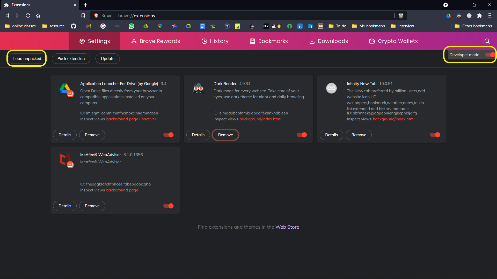
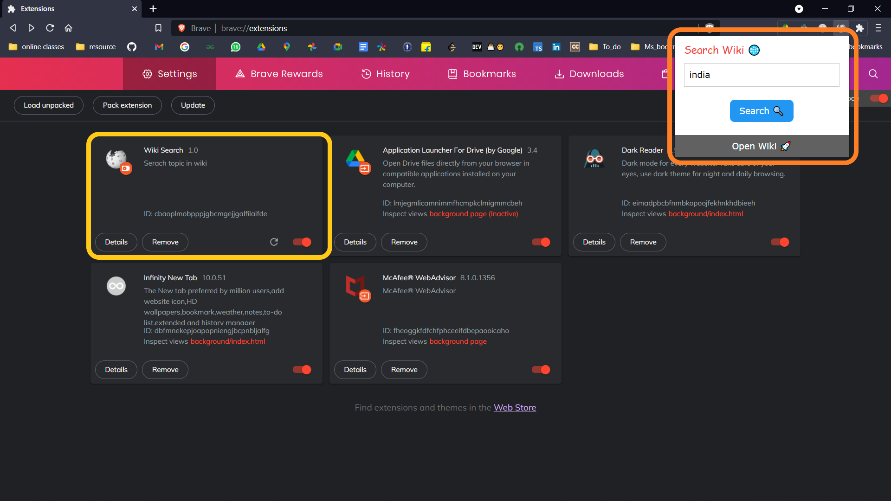

# Browser-Extensions

## Beginner level

1.**Wiki Serach:** 

it is a simple biggner level Browser Extension .**it helps user to search any topic in [wikipedia](https://www.wikipedia.org/) by just one click like any other browser extension**

**Browser-supported**:chrome , Brave ,Firefox (others are not tested)

**File used:**
 1. manifest.json (version-3)
 2. popup.html (for view)
 3. popup.js(for backend logical implementation)
 4. css(stylesheet)

**Instruction to load in browser:**
 1. You can **fork(repository and clone)/download** those folders in your local machine 
 2. Now go to **Extentions** option in your browser and turn on **developer mode**  
 3. then click on **Load unpacked** and select the folder the you have downloaded/colned 
 
 

 4. Now we are ready to go with  our the first basic browser extension named **wiki search**

      

